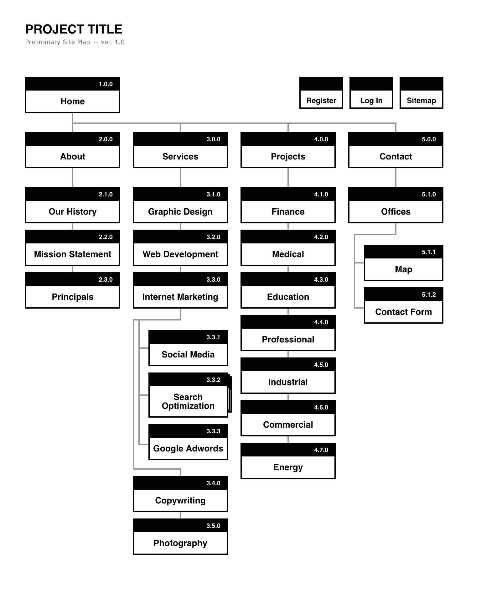

This is my attempt at making Slickmaps more modular. 

Now, it can start as a markdown list (exported from a mindmap app) and finish as a self-contained file.

---

Now, use as many levels as you'd like. Levels 4 and lower are placed as a stack below the level three item. They will grow sideways though, so don't go too deep.

Made as single page so it can be used as a template in iOS apps like Drafts (by Agile Tortoise). The hope being to use a simple list and then "markdown convert" to the final visual.

Original Slickmap created by Matt Everson (http://astuteo.com/slickmap)

All images converted to SVG and placed inline as data-urls (via http://codepen.io/shshaw/blog/responsive-placeholder-image)

Theme based on "A Project Guide to UX Design" (New Riders, 2009)

---

Current preferred method of building sitemaps starts with iThoughts on iOS. Send the sitemap.md file to Editorial.app. In Editorial, trigger a workflow that converts to final output. 

The workflow can be customized, but should take the file as input and run it through a 'multimarkdown to html' action. That action should have the contents of template.html.
